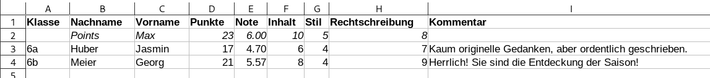
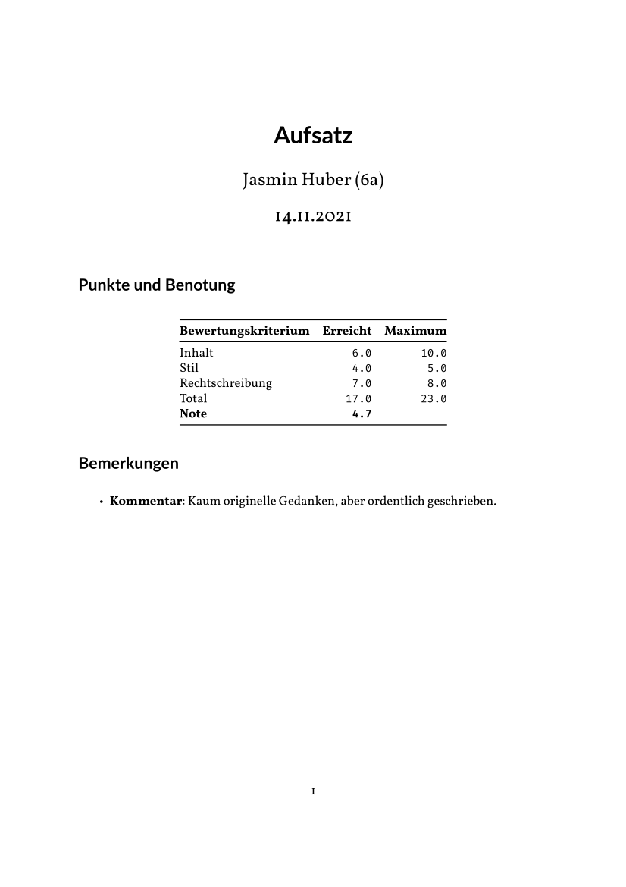

# GradeDocs

Turns Excel worksheets into grade/score PDFs.

## Example

Given such an Excel Worksheet (see `examples/example.xlsx`):

The following commands converts each line (except for the title and reference
line) into a Markdown file:

    $ gradedocs/build_docs.py examples/example.xlsx

In this example, two files will be generated:

    6a_huber_jasmin.md
    6b_meier_georg.md

Which can be converted to a PDF using the `Makefile` (given that `pandoc`,
XeLaTeX, and a couple of fonts—Lato, Vollkorn, Fira Code—are installed):

    $ make 6a_huber_jasmin.pdf

The result is a PDF that looks as follows:

Type `gradedocs/build_docs.py --help` for more information on the command line
parameters and arguments.
